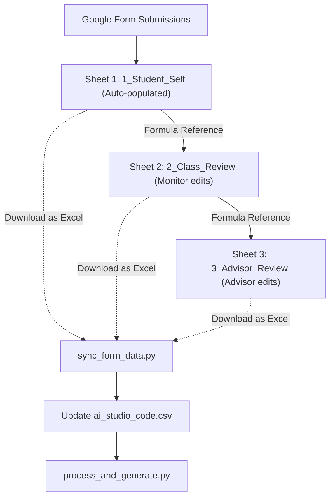

# Implementation Plan: Google Form Data Collection & Sync Workflow

This plan outlines the design of a Google Form for collecting student training point self-assessments, along with a python synchronization script to merge form responses directly into `ai_studio_code.csv`, preserving the existing processing pipeline.

---

## 🎯 Goal Description
Currently, student training scores are collected from manual `.doc`/`.docx` files and transcribed or parsed into `ai_studio_code.csv`.
This proposal replaces manual document collection with a **Google Form** filled by students. The form enforces step-increment rules at the source, calculates totals automatically, and syncs student self-scores directly with the pipeline.

---

## 📋 Google Form Structure & Input Validation
To satisfy all project constraints and step-increment rules from `GEMINI.md`, the Google Form questions must use specific answer formats.

### 1. Personal Information (Section 1)
| Field Name | Question Type | Validation Rule | Purpose |
|---|---|---|---|
| **Họ và tên** | Short Answer | Text | Student's full name |
| **Mã số sinh viên (MSV)** | Short Answer | Regex: `^N25[A-Z]{4}\d{3}$` (or similar) | Student ID, must match official roster format |
| **Ngày sinh** | Date | Required | Saved in `DD/MM/YYYY` format for `dob` column |

### 2. Evaluation Criteria (Sections 2 to 6)
To prevent mathematical inconsistencies (e.g. invalid GPA tiers or non-multiples), questions should be multiple choice or dropdowns rather than open-ended numbers:

| Criterion ID | Topic | Question Type & Options | Constraints Enforced |
|---|---|---|---|
| **1.1** | Ý thức thái độ trong học tập | Dropdown: `0, 1, 2, 3` | Max 3 |
| **1.2** | GPA classification | Multiple Choice:<br>- `10` (Xuất sắc)<br>- `8` (Giỏi)<br>- `6` (Khá)<br>- `4` (Trung bình)<br>- `0` (Yếu/Kém) | Only {0, 4, 6, 8, 10} allowed |
| **1.3** | Nội quy phòng thi | Dropdown: `0, 1, 2, 3, 4` | Max 4 |
| **1.4** | Hoạt động ngoại khóa | Multiple Choice: `0, 0.5, 1, 1.5, 2` | Multiples of 0.5, max 2 |
| **1.5** | Vượt khó vươn lên | Dropdown: `0, 1` | Max 1 |
| **2.1** | Chấp hành quy chế | Dropdown: `0, 1, 2, ..., 15` | Max 15 (Standard is 15) |
| **2.2** | Sinh hoạt lớp | Dropdown: `0, 1, 2, 3, 4, 5` | Max 5 (Standard is 5) |
| **2.3** | Hội thảo việc làm | Dropdown: `0, 1, 2, 3, 4, 5` | Max 5 (1 pt/seminar) |
| **3.1** | Hoạt động CT-XH | Multiple Choice: `0, 2, 4, 6, 8, 10` | Multiples of 2, max 10 |
| **3.2** | Hoạt động xã hội/từ thiện | Dropdown: `0, 1, 2, 3, 4` | Max 4 (1 pt/activity) |
| **3.3** | Tuyên truyền trường/khoa | Dropdown: `0, 1, 2, 3` | Max 3 (1 pt/activity) |
| **3.4** | Phòng chống tội phạm | Dropdown: `0, 1, 2, 3` | Max 3 |
| **3.5** | Bình luận/thông tin sai lệch | Dropdown:<br>- `0` (Không vi phạm)<br>- `-10` (Vi phạm) | Penalty criteria (-10 pts) |
| **4.1** | Chấp hành chủ trương | Dropdown: `0, 1, 2, ..., 8` | Max 8 |
| **4.2** | Tuyên truyền chủ trương | Dropdown: `0, 1, 2, 3, 4, 5` | Max 5 |
| **4.3** | Quan hệ với thầy cô | Dropdown: `0, 1, 2, 3, 4, 5` | Max 5 |
| **4.4** | Quan hệ với bạn bè | Dropdown: `0, 1, 2, 3, 4, 5` | Max 5 |
| **4.5** | Khen thưởng cộng đồng | Dropdown: `0, 1, 2` | Max 2 |
| **4.6** | Vi phạm trật tự/an toàn | Dropdown:<br>- `0` (Không vi phạm)<br>- `-5` (Vi phạm) | Penalty criteria (-5 pts) |
| **5.1** | Cán bộ lớp/đoàn | Dropdown: `0, 4` | Max 4 (0 or 4) |
| **5.2** | Câu lạc bộ | Dropdown: `0, 1, 2, 3` | Max 3 |
| **5.3** | Thành tích đặc biệt | Dropdown: `0, 1, 2, 3` | Max 3 |

*Note: Totals (`TC1` to `TC5` and `TOTAL`) do NOT need to be in the form. The sync script will compute these mathematically to prevent errors.*

---

## ⚡ Collaborative Google Sheets & Sync Strategy

To allow students to submit self-assessments, and the class monitor & academic advisor to easily review and adjust scores, we use a shared Google Spreadsheet with **three worksheets**:



### Google Sheet Worksheet Layout

1. **`1_Student_Self`**: 
   * Linked directly to the Google Form. Collects student self-scores.
2. **`2_Class_Review`**: 
   * Implements a cell-by-cell reference to Sheet 1: `=1_Student_Self!A1`.
   * During the class meeting, the monitor reviews the scores. If a student's score needs adjustment, the monitor simply overwrites the formula in that cell with the new hardcoded value.
3. **`3_Advisor_Review`**:
   * Implements reference to Sheet 2: `=2_Class_Review!A1`.
   * The academic advisor reviews and overwrites cell values to make adjustments.

### How it Syncs
By sharing the sheet with **"Anyone with link can view"**, we can query the export URL to download the entire multi-sheet workbook as an Excel file (`.xlsx` format) without requiring complex OAuth/Google API credentials:
```
https://docs.google.com/spreadsheets/d/<SHEET_ID>/export?format=xlsx
```

---

## 🛠️ Proposed Changes

### 1. `sync_form_data.py` [NEW]
This script downloads the Excel workbook from Google Sheets, extracts the three worksheets, parses the student info, updates `student_score`, `class_score`, and `advisor_score` columns in `ai_studio_code.csv` separately, and runs the pipeline.

```python
import os
import re
import csv
import sys
import argparse
import urllib.request
import openpyxl

# List of criteria
CRITERIA = ["1.1", "1.2", "1.3", "1.4", "1.5", "2.1", "2.2", "2.3", "3.1", "3.2", "3.3", "3.4", "3.5", "4.1", "4.2", "4.3", "4.4", "4.5", "4.6", "5.1", "5.2", "5.3"]
TC_GROUPS = {
    "TC1": ["1.1", "1.2", "1.3", "1.4", "1.5"],
    "TC2": ["2.1", "2.2", "2.3"],
    "TC3": ["3.1", "3.2", "3.3", "3.4", "3.5"],
    "TC4": ["4.1", "4.2", "4.3", "4.4", "4.5", "4.6"],
    "TC5": ["5.1", "5.2", "5.3"]
}

def parse_dob(dob_str):
    if not dob_str:
        return ""
    dob_str = dob_str.strip()
    # Handle YYYY-MM-DD format (standard ISO format from Google Forms date field)
    match_ymd = re.search(r"^(\d{4})[/-](\d{1,2})[/-](\d{1,2})", dob_str)
    if match_ymd:
        year, month, day = int(match_ymd.group(1)), int(match_ymd.group(2)), int(match_ymd.group(3))
        return f"{day:02d}/{month:02d}/{year}"
    # Handle DD/MM/YYYY format
    match_dmy = re.search(r"^(\d{1,2})[/-](\d{1,2})[/-](\d{4})", dob_str)
    if match_dmy:
        day, month, year = int(match_dmy.group(1)), int(match_dmy.group(2)), int(match_dmy.group(3))
        return f"{day:02d}/{month:02d}/{year}"
    return dob_str

def map_headers(headers):
    # Map raw headers to student metadata and criteria codes
    mapping = {}
    for idx, header in enumerate(headers):
        if not header:
            continue
        header_lower = str(header).lower()
        if (("mã" in header_lower and "sinh viên" in header_lower) or "msv" in header_lower):
            mapping["student_id"] = idx
        elif "ngày sinh" in header_lower or "dob" in header_lower:
            mapping["dob"] = idx
        else:
            for crit in CRITERIA:
                # Matches patterns like "1.1" or "1.1." or "Criteria 1.1"
                if re.search(r"\b" + re.escape(crit) + r"\b", str(header)):
                    mapping[crit] = idx
                    break
    return mapping

def read_sheet_rows(sheet):
    rows = []
    for r in range(1, sheet.max_row + 1):
        row_vals = [sheet.cell(r, c).value for c in range(1, sheet.max_column + 1)]
        # If the entire row is empty, skip it
        if any(v is not None for v in row_vals):
            rows.append([str(v) if v is not None else "" for v in row_vals])
    return rows

def extract_scores_from_rows(rows):
    if not rows or len(rows) < 2:
        return {}
        
    headers = rows[0]
    mapping = map_headers(headers)
    
    if "student_id" not in mapping:
        return {}
        
    scores_by_msv = {}
    for row in rows[1:]:
        if len(row) <= max(mapping.values()):
            continue
        msv = row[mapping["student_id"]].strip().upper()
        if not msv:
            continue
            
        scores = {}
        for crit in CRITERIA:
            val_str = row[mapping[crit]].strip() if crit in mapping else "0"
            try:
                scores[crit] = float(val_str.replace(",", "."))
            except ValueError:
                scores[crit] = 0.0
                
        # Calculate TC totals
        for tc, children in TC_GROUPS.items():
            scores[tc] = sum(scores[child] for child in children)
        scores["TOTAL"] = sum(scores[tc] for tc in TC_GROUPS.keys())
        
        dob_val = ""
        if "dob" in mapping:
            dob_val = parse_dob(row[mapping["dob"]])
            
        scores_by_msv[msv] = {
            "dob": dob_val,
            "scores": scores
        }
    return scores_by_msv

def sync_data(xlsx_path, workspace):
    if not os.path.exists(xlsx_path):
        print(f"Error: Excel file {xlsx_path} not found.")
        return

    wb = openpyxl.load_workbook(xlsx_path, data_only=True)
    sheet_names = wb.sheetnames
    
    sv_rows = []
    lop_rows = []
    
    for name in sheet_names:
        name_lower = name.lower()
        if "student" in name_lower or "self" in name_lower or "responses" in name_lower:
            sv_rows = read_sheet_rows(wb[name])
        elif "class" in name_lower or "lop" in name_lower or "evaluation" in name_lower:
            lop_rows = read_sheet_rows(wb[name])
            
    # Fallback to the first sheet as SV if none found
    if not sv_rows and len(sheet_names) > 0:
        sv_rows = read_sheet_rows(wb[sheet_names[0]])
        
    sv_data = extract_scores_from_rows(sv_rows)
    lop_data = extract_scores_from_rows(lop_rows)
    
    if not sv_data:
        print("No student self-evaluation data parsed.")
        return

    # Load existing CSV to preserve formatting and fields
    target_csv = os.path.join(workspace, "ai_studio_code.csv")
    existing_rows = []
    if os.path.exists(target_csv):
        with open(target_csv, "r", encoding="utf-8") as f:
            reader = csv.DictReader(f)
            existing_fields = reader.fieldnames
            existing_rows = list(reader)
    else:
        existing_fields = ["student_id", "semester", "criterion_id", "criterion_name", "max_points", "student_score", "class_score", "advisor_score", "note", "dob"]

    # Load roster from Excel to verify valid student IDs
    excel_path = os.path.join(workspace, "HV_Mau 2_Tong hop KQRL cua SV.xlsx")
    wb_roster = openpyxl.load_workbook(excel_path, data_only=True)
    sheet_roster = wb_roster.active
    
    valid_msvs = set()
    for r in range(14, sheet_roster.max_row + 1):
        msv = sheet_roster.cell(r, 4).value
        if msv:
            valid_msvs.add(str(msv).strip().upper())

    # Build updated database
    updated_rows = []
    updated_msvs = set()
    
    for row in existing_rows:
        msv = row["student_id"].strip().upper()
        crit_id = row["criterion_id"].strip()
        
        if msv in sv_data:
            updated_msvs.add(msv)
            # 1. Update Student self score
            resp_sv = sv_data[msv]
            if crit_id in resp_sv["scores"]:
                row["student_score"] = str(resp_sv["scores"][crit_id]).replace(".0", "")
            if resp_sv["dob"]:
                row["dob"] = resp_sv["dob"]
                
            # 2. Update Class and Advisor evaluation score (both set to Class Review score)
            if msv in lop_data:
                resp_lop = lop_data[msv]
                if crit_id in resp_lop["scores"]:
                    val = str(resp_lop["scores"][crit_id]).replace(".0", "")
                    row["class_score"] = val
                    row["advisor_score"] = val
                    
        updated_rows.append(row)

    # If new student entries are found
    for msv in sv_data:
        if msv not in updated_msvs and msv in valid_msvs:
            print(f"Creating new entries for MSV {msv}")
            resp_sv = sv_data[msv]
            resp_lop = lop_data.get(msv, {"scores": {}})
            
            for crit_id in CRITERIA + list(TC_GROUPS.keys()) + ["TOTAL"]:
                sv_val = str(resp_sv["scores"].get(crit_id, 0.0)).replace(".0", "")
                lop_val = str(resp_lop["scores"].get(crit_id, "")).replace(".0", "")
                
                updated_rows.append({
                    "student_id": msv,
                    "semester": "II",
                    "criterion_id": crit_id,
                    "criterion_name": f"Criterion {crit_id}",
                    "max_points": "",
                    "student_score": sv_val,
                    "class_score": lop_val,
                    "advisor_score": lop_val, # Advisor score matches Class score
                    "note": "",
                    "dob": resp_sv["dob"]
                })

    # Write out
    with open(target_csv, "w", newline="", encoding="utf-8") as f:
        writer = csv.DictWriter(f, fieldnames=existing_fields)
        writer.writeheader()
        writer.writerows(updated_rows)
        
    print(f"Successfully synced spreadsheet scores to {target_csv}")

if __name__ == "__main__":
    parser = argparse.ArgumentParser(description="Sync Google Form responses and class/advisor evaluations with database.")
    group = parser.add_mutually_exclusive_group(required=True)
    group.add_argument("--sheet-id", type=str, help="Google Sheets ID of the shared evaluation spreadsheet.")
    group.add_argument("--xlsx", type=str, help="Path to local downloaded Excel spreadsheet.")
    
    args = parser.parse_args()
    workspace = os.path.dirname(os.path.abspath(__file__))
    
    if args.sheet_id:
        url = f"https://docs.google.com/spreadsheets/d/{args.sheet_id}/export?format=xlsx"
        xlsx_path = os.path.join(workspace, "temp_evaluation.xlsx")
        print(f"Downloading shared Google Sheet from: {url}")
        try:
            # Bypass potential user-agent blocking by setting request headers
            req = urllib.request.Request(url, headers={'User-Agent': 'Mozilla/5.0'})
            with urllib.request.urlopen(req) as response, open(xlsx_path, 'wb') as out_file:
                out_file.write(response.read())
            print("Download completed successfully.")
        except Exception as e:
            print(f"Error downloading Google Sheet: {e}")
            sys.exit(1)
    else:
        xlsx_path = os.path.abspath(args.xlsx)
        
    sync_data(xlsx_path, workspace)
    
    # Clean up temp file
    if args.sheet_id and os.path.exists(xlsx_path):
        os.remove(xlsx_path)
```

### 2. `process_and_generate.py` [MODIFY]
Enable writing criteria `3.5` and `4.6` to the Word documents. This requires modifying `write_csv_score_to_table`:

```diff
     elif criterion_id == "3.4":
         write_centered_score(table.rows[35].cells[role_col], val_str)
+    elif criterion_id == "3.5":
+        write_centered_score(table.rows[36].cells[role_col], val_str)
     elif criterion_id == "4.1":
         write_centered_score(table.rows[39].cells[role_col], val_str)
     elif criterion_id == "4.2":
         write_centered_score(table.rows[40].cells[role_col], val_str)
     elif criterion_id == "4.3":
         write_centered_score(table.rows[41].cells[role_col], val_str)
     elif criterion_id == "4.4":
         write_centered_score(table.rows[42].cells[role_col], val_str)
     elif criterion_id == "4.5":
         write_centered_score(table.rows[43].cells[role_col], val_str)
+    elif criterion_id == "4.6":
+        write_centered_score(table.rows[44].cells[role_col], val_str)
     elif criterion_id == "5.1":
```

---

## 🧪 Verification Plan

### Automated Verification
After running synchronization, run standard execution:
```bash
python3 process_and_generate.py
```
This ensures:
1. No crash occurs while parsing the new CSV database.
2. The totals overwritten by Excel match, and no mathematical errors crop up.
3. The Word files and charts are generated cleanly.

### Manual Verification
1. Open one of the generated Word documents in `generated_students/` (e.g. `Nguyễn Văn Trãi_N25DECE085.docx`) and check that:
   - Personal info matches.
   - Row 36 (3.5) and Row 44 (4.6) show the synchronized value (normally `0` or blank unless a penalty is active).
2. Open `assets/drl_dashboard.html` to verify the dashboard loads the new cohort data.
