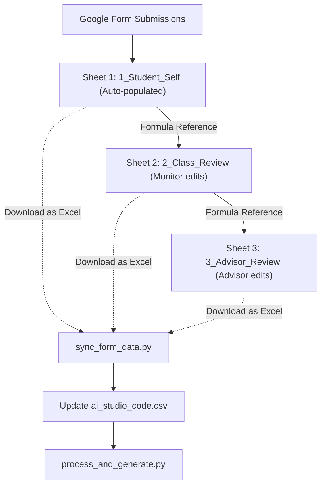

# Implementation Plan: Google Form Data Collection & Sync Workflow

This plan outlines the design of a Google Form for collecting student training point self-assessments, along with a python synchronization script to merge form responses directly into `ai_studio_code.csv`, preserving the existing processing pipeline.

---

## 🎯 Goal Description
Currently, student training scores are collected from manual `.doc`/`.docx` files and transcribed or parsed into `ai_studio_code.csv`.
This proposal replaces manual document collection with a **Google Form** filled by students. The form enforces step-increment rules at the source, calculates totals automatically, and syncs student self-scores directly with the pipeline.

---

## 📋 Google Form Structure & Input Validation
To satisfy all project constraints and step-increment rules from `GEMINI.md`, the Google Form questions must use specific answer formats.

### 1. Personal Information (Section 1)
| Field Name | Question Type | Validation Rule | Purpose |
|---|---|---|---|
| **Họ và tên** | Short Answer | Text | Student's full name |
| **Mã số sinh viên (MSV)** | Short Answer | Regex: `^N25[A-Z]{4}\d{3}$` (or similar) | Student ID, must match official roster format |
| **Ngày sinh** | Date | Required | Saved in `DD/MM/YYYY` format for `dob` column |

### 2. Evaluation Criteria (Sections 2 to 6)
To prevent mathematical inconsistencies (e.g. invalid GPA tiers or non-multiples), questions should be multiple choice or dropdowns rather than open-ended numbers:

| Criterion ID | Topic | Question Type & Options | Constraints Enforced |
|---|---|---|---|
| **1.1** | Ý thức thái độ trong học tập | Dropdown: `0, 1, 2, 3` | Max 3 |
| **1.2** | GPA classification | Multiple Choice:<br>- `10` (Xuất sắc)<br>- `8` (Giỏi)<br>- `6` (Khá)<br>- `4` (Trung bình)<br>- `0` (Yếu/Kém) | Only {0, 4, 6, 8, 10} allowed |
| **1.3** | Nội quy phòng thi | Dropdown: `0, 1, 2, 3, 4` | Max 4 |
| **1.4** | Hoạt động ngoại khóa | Multiple Choice: `0, 0.5, 1, 1.5, 2` | Multiples of 0.5, max 2 |
| **1.5** | Vượt khó vươn lên | Dropdown: `0, 1` | Max 1 |
| **2.1** | Chấp hành quy chế | Dropdown: `0, 1, 2, ..., 15` | Max 15 (Standard is 15) |
| **2.2** | Sinh hoạt lớp | Dropdown: `0, 1, 2, 3, 4, 5` | Max 5 (Standard is 5) |
| **2.3** | Hội thảo việc làm | Dropdown: `0, 1, 2, 3, 4, 5` | Max 5 (1 pt/seminar) |
| **3.1** | Hoạt động CT-XH | Multiple Choice: `0, 2, 4, 6, 8, 10` | Multiples of 2, max 10 |
| **3.2** | Hoạt động xã hội/từ thiện | Dropdown: `0, 1, 2, 3, 4` | Max 4 (1 pt/activity) |
| **3.3** | Tuyên truyền trường/khoa | Dropdown: `0, 1, 2, 3` | Max 3 (1 pt/activity) |
| **3.4** | Phòng chống tội phạm | Dropdown: `0, 1, 2, 3` | Max 3 |
| **3.5** | Bình luận/thông tin sai lệch | Dropdown:<br>- `0` (Không vi phạm)<br>- `-10` (Vi phạm) | Penalty criteria (-10 pts) |
| **4.1** | Chấp hành chủ trương | Dropdown: `0, 1, 2, ..., 8` | Max 8 |
| **4.2** | Tuyên truyền chủ trương | Dropdown: `0, 1, 2, 3, 4, 5` | Max 5 |
| **4.3** | Quan hệ với thầy cô | Dropdown: `0, 1, 2, 3, 4, 5` | Max 5 |
| **4.4** | Quan hệ với bạn bè | Dropdown: `0, 1, 2, 3, 4, 5` | Max 5 |
| **4.5** | Khen thưởng cộng đồng | Dropdown: `0, 1, 2` | Max 2 |
| **4.6** | Vi phạm trật tự/an toàn | Dropdown:<br>- `0` (Không vi phạm)<br>- `-5` (Vi phạm) | Penalty criteria (-5 pts) |
| **5.1** | Cán bộ lớp/đoàn | Dropdown: `0, 4` | Max 4 (0 or 4) |
| **5.2** | Câu lạc bộ | Dropdown: `0, 1, 2, 3` | Max 3 |
| **5.3** | Thành tích đặc biệt | Dropdown: `0, 1, 2, 3` | Max 3 |

*Note: Totals (`TC1` to `TC5` and `TOTAL`) do NOT need to be in the form. The sync script will compute these mathematically to prevent errors.*

---

## ⚡ Collaborative Google Sheets & Sync Strategy

To allow students to submit self-assessments, and the class monitor & academic advisor to easily review and adjust scores, we use a shared Google Spreadsheet with **three worksheets**:


### Google Sheet Worksheet Layout

1. **`1_Student_Self`**: 
   * Linked directly to the Google Form. Collects student self-scores.
2. **`2_Class_Review`**: 
   * Starts as a copy of `1_Student_Self` (via cell formulas or copy-paste).
   * During the class meeting, the monitor reviews the scores. If a student's score needs adjustment, the monitor simply overwrites that cell with the new adjusted value.
   * This worksheet also acts as the advisor's final score database (as they are merged).

### 🛠️ Click-by-Click Setup Guide

Choose one of the two methods below to set up your Google Form and link it to your Google Sheet:

---

#### 🟢 Option A: Programmatic Generation via Google Apps Script (Fast & Accurate)
Use this option to automatically build the form, set up character validation for the MSV field, populate all 22 questions with their exact valid dropdown choices, and link it back to your active spreadsheet in seconds.

1. Create a new Google Sheet (or open your existing evaluation spreadsheet).
2. From the top menu, go to **Extensions > Apps Script**.
3. Clear any default code in the editor, and paste the following Google Apps Script:

```javascript
function generateDRLForm() {
  // 1. Create a new Google Form
  var form = FormApp.create('Phiếu Đánh Giá Rèn Luyện E25CQCE02-N');
  form.setDescription('Phiếu tự đánh giá điểm rèn luyện của sinh viên - Học kỳ II.');
  form.setCollectEmail(false);
  
  // 2. Add Required Personal Info
  form.addTextItem().setTitle('Họ và tên').setRequired(true);
  
  // 3. Add MSV with exact Regex Validation matching roster
  var msvItem = form.addTextItem().setTitle('Mã số sinh viên (MSV)').setRequired(true);
  var msvValidation = FormApp.createTextValidation()
    .requireTextMatchesPattern('^N25[A-Z]{4}\\d{3}$') // Enforces: N25 + 4 uppercase letters + 3 digits
    .setHelpText('MSV phải đúng định dạng (Ví dụ: N25DCCN001)')
    .build();
  msvItem.setValidation(msvValidation);
  
  // 4. Add Date of Birth (standard Form date format)
  form.addDateItem().setTitle('Ngày sinh').setRequired(true);
  
  // 5. Build list of all 22 criteria questions with correct score bounds
  var criteria = [
    { id: '1.1', title: '1.1 Ý thức và thái độ trong học tập: Đi học đầy đủ, đúng giờ, nghiêm túc trong giờ học, giờ thực hành', max: 3, choices: ['0', '1', '2', '3'] },
    { id: '1.2', title: '1.2 Kết quả học tập trong kỳ học\n+ Có kết quả học tập xếp loại Xuất sắc (10 điểm)\n+ Có kết quả học tập đạt loại Giỏi (8 điểm)\n+ Có kết quả học tập đạt loại Khá (6 điểm)\n+ Có kết quả học tập đạt loại Trung bình (4 điểm)\n+ Có kết quả học tập đạt loại dưới Trung bình (0 điểm)\n- Học lại (phần lý thuyết/ thực hành) (Bị trừ 1 điểm/học phần)', max: 10, choices: ['0', '4', '6', '8', '10'] },
    { id: '1.3', title: '1.3 Ý thức chấp hành tốt nội quy về các kỳ thi\nSinh viên bị trừ điểm trong các trường hợp/1 lần vi phạm:\n+ Không đủ điều kiện dự thi/bị cấm thi cho mỗi học phần (lý thuyết/ thực hành) (- 2 điểm)\n+ Bị lập biên bản khiển trách khi thi kết thúc học phần (- 2 điểm)\n+ Bị lập biên bản cảnh cáo khi thi kết thúc học phần (- 3 điểm)\n+ Bị lập biên bản đình chỉ khi thi kết thúc học phần (- 4 điểm)', max: 4, choices: ['0', '1', '2', '3', '4'] },
    { id: '1.4', title: '1.4 Ý thức và thái độ tham gia các hoạt động ngoại khóa, các sự kiện liên quan đến nghiên cứu khoa học, học thuật, chuyên môn, Câu lạc bộ (0,5 điểm/1 sự kiện, hoạt động tham gia, tổng điểm không vượt quá 2 điểm)', max: 2, choices: ['0', '0.5', '1', '1.5', '2'] },
    { id: '1.5', title: '1.5 Tinh thần vượt khó, phấn đấu vươn lên trong học tập (có ĐTBCTL học kỳ sau lớn hơn học kỳ trước đó; đối với sinh viên năm thứ nhất, học kỳ 1 không có điểm dưới 2,5)', max: 1, choices: ['0', '1'] },
    { id: '2.1', title: '2.1 Thực hiện nghiêm túc các nội quy, quy chế, các quy định hiện hành trong Học viện.\n- Sinh viên bị trừ điểm trong các trường hợp:\n+ Không đóng học phí theo quy định (- 15 điểm)\n+ Không thực hiện quy định về công tác ngoại trú, nội trú. (- 5 điểm)', max: 15, choices: ['0', '5', '10', '15'] },
    { id: '2.2', title: '2.2 - Thực hiện nghiêm túc các buổi họp lớp/ sinh hoạt đoàn thể do Học viện/Khoa/Viện, CVHT, Lớp/Chi đoàn tổ chức (tùy thuộc vào số buổi tổ chức sinh hoạt, họp)\n- Vắng 01 buổi họp lớp/ sinh hoạt đoàn thể (không lý do) (-1 điểm)', max: 5, choices: ['0', '1', '2', '3', '4', '5'] },
    { id: '2.3', title: '2.3 - Tham gia các buổi hội thảo việc làm, định hướng nghề nghiệp do Học viện tổ chức (1 điểm/1 sự kiện tham gia, tổng điểm không vượt quá 5 điểm)\n- Vắng 01 buổi (-2 điểm)', max: 5, choices: ['0', '1', '2', '3', '4', '5'] },
    { id: '3.1', title: '3.1 Tham gia đầy đủ các hoạt động chính trị, xã hội, các hoạt động văn hóa, văn nghệ, thể thao, phong trào tình nguyện, các buổi sinh hoạt chuyên đề do Học viện, lớp/chi đoàn, địa phương nơi cư trú  tổ chức  (2 điểm/1 hoạt động, tổng điểm không vượt quá 10 điểm)', max: 10, choices: ['0', '2', '4', '6', '8', '10'] },
    { id: '3.2', title: '3.2 Tham gia công tác xã hội như: hiến máu nhân đạo, ủng hộ người nghèo gặp thiên tai lũ lụt và các công tác xã hội khác (1 điểm/1 hoạt động tham gia, tổng điểm không vượt quá 4 điểm)', max: 4, choices: ['0', '1', '2', '3', '4'] },
    { id: '3.3', title: '3.3 Tuyên truyền tích cực hình ảnh về Trường/Khoa trên các trang mạng xã hội (1 điểm/1 hoạt động, tổng điểm không vượt quá 3 điểm)', max: 3, choices: ['0', '1', '2', '3'] },
    { id: '3.4', title: '3.4 Tích cực tham gia các hoạt động phòng, chống tội phạm, các tệ nạn xã hội, phát hiện và báo cáo kịp thời những hành vi có liên quan đến ma túy, các tệ nạn xã hội khác', max: 3, choices: ['0', '1', '2', '3'] },
    { id: '3.5', title: '3.5 Đưa các thông tin sai lệch, thông tin chưa được kiểm chứng, đăng bình luận không chính xác, thiếu tích cực về Học viện/ Khoa/ ngành đang học.', max: 0, choices: ['0', '-10'] },
    { id: '4.1', title: '4.1 Chấp hành nghiêm chỉnh chủ trương của Đảng, chính sách, pháp luật của Nhà nước, Học viện và của địa phương nơi cư trú', max: 8, choices: ['0', '2', '4', '6', '8'] },
    { id: '4.2', title: '4.2 Tích cực tham gia tuyên truyền chủ trương của Đảng, chính sách, pháp luật của Nhà nước, Học viện  và quy định của địa phương nơi cư trú; có ý thức thực hiện giữ gìn vệ sinh chung', max: 5, choices: ['0', '1', '2', '3', '4', '5'] },
    { id: '4.3', title: '4.3 Có mối quan hệ đúng mực với Thầy/ Cô, cán bộ, nhân viên Học viện', max: 5, choices: ['0', '1', '2', '3', '4', '5'] },
    { id: '4.4', title: '4.4 Có mối quan hệ tốt với bạn bè trong lớp và mọi người xung quanh; có tinh thần đoàn kết, chia sẻ, giúp đỡ nhau trong học tập và các vấn đề khác trong cộng đồng', max: 5, choices: ['0', '1', '2', '3', '4', '5'] },
    { id: '4.5', title: '4.5 Được biểu dương khen thưởng trong các hoạt động liên quan đến ý thức công dân trong quan hệ cộng đồng', max: 2, choices: ['0', '1', '2'] },
    { id: '4.6', title: '4.6 Vi phạm an ninh, trật tự xã hội; an toàn giao thông (có giấy báo của các cơ quan hữu quan)', max: 0, choices: ['0', '-5'] },
    { id: '5.1', title: '5.1 Sinh viên được Học viện phân công làm lớp trưởng, lớp phó; bí thư, phó bí thư chi đoàn, BCH đoàn Học viện/khoa; BCH Hội sinh viên Học viện/khoa; chủ nhiệm, phó chủ nhiệm các các Câu lạc bộ, đội nhóm trực thuộc Học viện/khoa được tập thể sinh viên và đơn vị quản lý ghi nhận hoàn thành nhiệm vụ.', max: 4, choices: ['0', '4'] },
    { id: '5.2', title: '5.2 Thành viên tham gia các Câu lạc bộ, đội nhóm trực thuộc Học viện /khoa được tập thể sinh viên và đơn vị quản lý ghi nhận hoàn thành tốt nhiệm vụ; sinh viên tham gia tổ chức các chương trình, là cộng tác viên tham gia tích cực vào các hoạt động chung cấp Học viện, khoa.', max: 3, choices: ['0', '1', '2', '3'] },
    { id: '5.3', title: '5.3 Sinh viên đạt thành tích đặc biệt trong học tập, rèn luyện:\n- Đạt giải thưởng trong nghiên cứu khoa học, các cuộc thi Olympic các cấp.\n- Đạt huy chương, giấy khen, giải thưởng các cấp về văn hóa, văn nghệ, thể thao, phòng chống các tệ nạn xã hội, hoạt động vì cộng đồng...', max: 3, choices: ['0', '1', '2', '3'] }
  ];
  
  // 6. Loop to generate each Dropdown question
  for (var i = 0; i < criteria.length; i++) {
    var c = criteria[i];
    var item = form.addListItem();
    item.setTitle(c.title + ' (Tối đa: ' + c.max + ' điểm)')
        .setChoiceValues(c.choices)
        .setRequired(true);
  }
  
  // 7. Link Form Responses back to this active Google Sheet
  var ss = SpreadsheetApp.getActiveSpreadsheet();
  form.setDestination(FormApp.DestinationType.SPREADSHEET, ss.getId());
  
  Logger.log('Form created successfully!');
  Logger.log('Form Edit URL: ' + form.getEditUrl());
}
```
4. Click the **Save (Disk)** icon, then select `generateDRLForm` from the dropdown list next to the **Debug** button, and click **Run**.
5. Give the script permission to access your Google Drive/Forms. 
6. Once complete, check the Apps Script log: it will print the edit URL of the newly created form. Close Apps Script and return to your Google Sheet: a new sheet (tab) named `Form Responses 1` will have been added.
7. Rename `Form Responses 1` to **`1_Student_Self`**.

---

#### 🔵 Option B: Manual Construction (Traditional)
Use this if you prefer to build the Google Form step-by-step in the browser interface.

1. Go to [Google Forms](https://forms.google.com) and click **Blank form**.
2. Name the form: `Phiếu Đánh Giá Rèn Luyện E25CQCE02-N`.
3. Add the **Personal Info** questions (Set all to **Required**):
   * **Họ và tên**: Short Answer
   * **Mã số sinh viên (MSV)**: Short Answer
     * Click the 3 dots (bottom right of the question box) > select **Response validation**.
     * Set rule to: **Regular expression** > **Matches** > Pattern: `^N25[A-Z]{4}\d{3}$`. (Ensures correct MSV format).
   * **Ngày sinh**: Date
4. Add the **22 criteria questions** as **Dropdown** questions. Make sure you use the exact option values specified in the scoring rules table (e.g. `0, 1, 2, 3` for 1.1; `10, 8, 6, 4, 0` for 1.2; `0, 0.5, 1.0, 1.5, 2.0` for 1.4).
5. **Link the Form to Sheets**:
   * Open the Form in editor mode, click the **Responses** tab at the top.
   * Click the green **Sheets icon** (or select **Link to Sheets**).
   * Choose **Create a new spreadsheet** (or select your active sheet) and click **Create**.
   * In the resulting spreadsheet, rename the default sheet from `Form Responses 1` to **`1_Student_Self`**.

---

#### ⚙️ Post-Creation Spreadsheet Steps (Applies to both Options)

##### Step 1: Set up the Class Review Worksheet
1. In your linked spreadsheet, click the **`+`** icon (bottom left) to add a new tab.
2. Rename this new tab to **`2_Class_Review`**.
3. Select one of the methods below to duplicate data for editing:
   * **Method A (Cell-by-cell formulas)**:
     * In cell A1 of `2_Class_Review`, type: `=IF('1_Student_Self'!A1="","",'1_Student_Self'!A1)`.
     * Drag/fill this formula across columns A to AB and down for your class roster's length.
     * During review, simply select any cell you want to adjust (e.g., E5) and type the new value. It replaces the formula for that cell only.
   * **Method B (Copy-Paste Values)**:
     * When form submissions close, copy the entire `1_Student_Self` sheet (`Ctrl+A` then `Ctrl+C`).
     * Go to `2_Class_Review` cell A1, right-click, and select **Paste special > Values only**. Edit cells directly.

##### Step 2: Share and Get Spreadsheet ID
1. Click the **Share** button (top right of Google Sheets).
2. Under "General access", select **Anyone with the link**. Set the role as **Viewer** (view-only is safe and prevents students from changing reviews).
3. Copy the Spreadsheet ID from the URL:
   `https://docs.google.com/spreadsheets/d/` **`1A2B3C4D5E_SpreadsheetID_Here`** `/edit#gid=0`

### How it Syncs
By sharing the sheet, the Python sync script downloads the entire multi-sheet workbook as an Excel file (`.xlsx`) using:
```
https://docs.google.com/spreadsheets/d/<SPREADSHEET_ID>/export?format=xlsx
```

---

## 🛠️ Proposed Changes

### 1. `sync_form_data.py` [NEW]
This script downloads the Excel workbook from Google Sheets
```python
import os
import re
import csv
import sys
import argparse
import urllib.request
import openpyxl

# All criteria in the exact order expected by the pipeline and Word template
CRITERIA_ORDER = [
    "1.1", "1.2", "1.3", "1.4", "1.5", "TC1",
    "2.1", "2.2", "2.3", "TC2",
    "3.1", "3.2", "3.3", "3.4", "3.5", "TC3",
    "4.1", "4.2", "4.3", "4.4", "4.5", "4.6", "TC4",
    "5.1", "5.2", "5.3", "TC5",
    "TOTAL"
]

CRITERIA_LEAVES = ["1.1", "1.2", "1.3", "1.4", "1.5", "2.1", "2.2", "2.3", "3.1", "3.2", "3.3", "3.4", "3.5", "4.1", "4.2", "4.3", "4.4", "4.5", "4.6", "5.1", "5.2", "5.3"]

TC_GROUPS = {
    "TC1": ["1.1", "1.2", "1.3", "1.4", "1.5"],
    "TC2": ["2.1", "2.2", "2.3"],
    "TC3": ["3.1", "3.2", "3.3", "3.4", "3.5"],
    "TC4": ["4.1", "4.2", "4.3", "4.4", "4.5", "4.6"],
    "TC5": ["5.1", "5.2", "5.3"]
}

CRITERION_NAMES = {
    "1.1": "Ý thức và thái độ trong học tập",
    "1.2": "Kết quả học tập trong kỳ học",
    "1.3": "Ý thức chấp hành tốt nội quy về các kỳ thi",
    "1.4": "Ý thức và thái độ tham gia các hoạt động ngoại khóa",
    "1.5": "Tinh thần vượt khó phấn đấu vươn lên trong học tập",
    "TC1": "Mức điểm tối đa Tiêu chí 1",
    "2.1": "Thực hiện nghiêm túc các nội quy quy chế",
    "2.2": "Thực hiện nghiêm túc các buổi họp lớp",
    "2.3": "Tham gia các buổi hội thảo việc làm",
    "TC2": "Mức điểm tối đa Tiêu chí 2",
    "3.1": "Tham gia đầy đủ các hoạt động chính trị xã hội",
    "3.2": "Tham gia công tác xã hội",
    "3.3": "Tuyên truyền tích cực hình ảnh về Trường/Khoa",
    "3.4": "Tích cực tham gia các hoạt động phòng chống tội phạm",
    "3.5": "Đưa các thông tin sai lệch thiếu tích cực về Học viện",
    "TC3": "Mức điểm tối đa Tiêu chí 3",
    "4.1": "Chấp hành nghiêm chỉnh chủ trương của Đảng",
    "4.2": "Tích cực tham gia tuyên truyền chủ trương của Đảng",
    "4.3": "Có mối quan hệ đúng mực với Thầy/ Cô",
    "4.4": "Có mối quan hệ tốt với bạn bè trong lớp",
    "4.5": "Được biểu dung khen thưởng",
    "4.6": "Vi phạm an ninh trật tự xã hội an toàn giao thông",
    "TC4": "Mức điểm tối đa Tiêu chí 4",
    "5.1": "Sinh viên làm lớp trưởng lớp phó",
    "5.2": "Thành viên tham gia các Câu lạc bộ",
    "5.3": "Sinh viên đạt thành tích đặc biệt",
    "TC5": "Mức điểm tối đa Tiêu chí 5",
    "TOTAL": "TỔNG CỘNG"
}

CRITERION_MAX = {
    "1.1": 3, "1.2": 10, "1.3": 4, "1.4": 2, "1.5": 1, "TC1": 20,
    "2.1": 15, "2.2": 5, "2.3": 5, "TC2": 25,
    "3.1": 10, "3.2": 4, "3.3": 3, "3.4": 3, "3.5": 0, "TC3": 20,
    "4.1": 8, "4.2": 5, "4.3": 5, "4.4": 5, "4.5": 2, "4.6": 0, "TC4": 25,
    "5.1": 4, "5.2": 3, "5.3": 3, "TC5": 10,
    "TOTAL": 100
}

def parse_dob(dob_str):
    if not dob_str:
        return ""
    dob_str = str(dob_str).strip()
    # Handle YYYY-MM-DD format
    match_ymd = re.search(r"^(\d{4})[/-](\d{1,2})[/-](\d{1,2})", dob_str)
    if match_ymd:
        year, month, day = int(match_ymd.group(1)), int(match_ymd.group(2)), int(match_ymd.group(3))
        return f"{day:02d}/{month:02d}/{year}"
    # Handle DD/MM/YYYY format
    match_dmy = re.search(r"^(\d{1,2})[/-](\d{1,2})[/-](\d{4})", dob_str)
    if match_dmy:
        day, month, year = int(match_dmy.group(1)), int(match_dmy.group(2)), int(match_dmy.group(3))
        return f"{day:02d}/{month:02d}/{year}"
    return dob_str

def map_headers(headers):
    mapping = {}
    for idx, header in enumerate(headers):
        if not header:
            continue
        header_lower = str(header).lower()
        if (("mã" in header_lower and "sinh viên" in header_lower) or "msv" in header_lower):
            mapping["student_id"] = idx
        elif "ngày sinh" in header_lower or "dob" in header_lower:
            mapping["dob"] = idx
        else:
            for crit in CRITERIA_LEAVES:
                if re.search(r"\b" + re.escape(crit) + r"\b", str(header)):
                    mapping[crit] = idx
                    break
    return mapping

def read_sheet_rows(sheet):
    rows = []
    for r in range(1, sheet.max_row + 1):
        row_vals = [sheet.cell(r, c).value for c in range(1, sheet.max_column + 1)]
        if any(v is not None for v in row_vals):
            rows.append([str(v) if v is not None else "" for v in row_vals])
    return rows

def extract_scores_from_rows(rows):
    if not rows or len(rows) < 2:
        return {}
        
    headers = rows[0]
    mapping = map_headers(headers)
    
    if "student_id" not in mapping:
        return {}
        
    scores_by_msv = {}
    for row in rows[1:]:
        if len(row) <= max(mapping.values()):
            continue
        msv = row[mapping["student_id"]].strip().upper()
        if not msv:
            continue
            
        scores = {}
        for crit in CRITERIA_LEAVES:
            val_str = row[mapping[crit]].strip() if crit in mapping else "0"
            try:
                scores[crit] = float(val_str.replace(",", "."))
            except ValueError:
                scores[crit] = 0.0
                
        # Calculate TC totals
        for tc, children in TC_GROUPS.items():
            scores[tc] = sum(scores[child] for child in children)
        scores["TOTAL"] = sum(scores[tc] for tc in TC_GROUPS.keys())
        
        dob_val = ""
        if "dob" in mapping:
            dob_val = parse_dob(row[mapping["dob"]])
            
        scores_by_msv[msv] = {
            "dob": dob_val,
            "scores": scores
        }
    return scores_by_msv

def sync_data(xlsx_path, workspace):
    if not os.path.exists(xlsx_path):
        print(f"Error: Excel file {xlsx_path} not found.")
        return

    wb = openpyxl.load_workbook(xlsx_path, data_only=True)
    sheet_names = wb.sheetnames
    
    sv_rows = []
    lop_rows = []
    
    for name in sheet_names:
        name_lower = name.lower()
        if "student" in name_lower or "self" in name_lower or "responses" in name_lower:
            sv_rows = read_sheet_rows(wb[name])
        elif "class" in name_lower or "lop" in name_lower or "evaluation" in name_lower:
            lop_rows = read_sheet_rows(wb[name])
            
    if not sv_rows and len(sheet_names) > 0:
        sv_rows = read_sheet_rows(wb[sheet_names[0]])
        
    sv_data = extract_scores_from_rows(sv_rows)
    lop_data = extract_scores_from_rows(lop_rows)
    
    if not sv_data:
        print("No student self-evaluation data parsed.")
        return

    # Load existing CSV database to preserve manual fields (notes, and class/advisor scores of unadjusted students)
    target_csv = os.path.join(workspace, "ai_studio_code.csv")
    existing_db = {} # msv -> crit_id -> {sv, class, advisor, note, dob}
    if os.path.exists(target_csv):
        with open(target_csv, "r", encoding="utf-8") as f:
            for row in csv.DictReader(f):
                msv = row["student_id"].strip().upper()
                crit_id = row["criterion_id"].strip()
                if msv not in existing_db:
                    existing_db[msv] = {}
                existing_db[msv][crit_id] = {
                    "sv": row.get("student_score", ""),
                    "lop": row.get("class_score", ""),
                    "cvht": row.get("advisor_score", ""),
                    "note": row.get("note", ""),
                    "dob": row.get("dob", "")
                }

    # Load official roster from Excel
    roster_path = os.path.join(workspace, "HV_Mau 2_Tong hop KQRL cua SV.xlsx")
    valid_students = [] # list of {tt, last_name, first_name, name, msv}
    if os.path.exists(roster_path):
        wb_roster = openpyxl.load_workbook(roster_path, data_only=True)
        sheet_roster = wb_roster.active
        for r in range(14, sheet_roster.max_row + 1):
            tt = sheet_roster.cell(r, 1).value
            last_name = sheet_roster.cell(r, 2).value
            first_name = sheet_roster.cell(r, 3).value
            msv = sheet_roster.cell(r, 4).value
            
            is_valid_tt = False
            if isinstance(tt, (int, float)):
                is_valid_tt = True
            elif isinstance(tt, str):
                try:
                    float(tt)
                    is_valid_tt = True
                except ValueError:
                    pass
                    
            if is_valid_tt and last_name and first_name and msv:
                msv_str = str(msv).strip().upper()
                if msv_str.startswith("N25"):
                    full_name = f"{str(last_name).strip()} {str(first_name).strip()}"
                    full_name = " ".join(full_name.split())
                    valid_students.append({
                        "tt": int(float(tt)),
                        "msv": msv_str,
                        "name": full_name
                    })

    # If roster could not be loaded, use keys from existing db
    if not valid_students:
        print("Warning: Roster Excel not loaded. Using existing CSV keys.")
        for msv in sorted(existing_db.keys()):
            valid_students.append({"msv": msv})

    # Rebuild database rows
    updated_rows = []
    
    for s in valid_students:
        msv = s["msv"]
        
        # Determine dob (prioritize Form responses over existing db)
        dob_val = ""
        if msv in sv_data and sv_data[msv]["dob"]:
            dob_val = sv_data[msv]["dob"]
        elif msv in existing_db:
            # Get any non-empty dob
            for c_id in CRITERIA_ORDER:
                if c_id in existing_db[msv] and existing_db[msv][c_id]["dob"]:
                    dob_val = existing_db[msv][c_id]["dob"]
                    break
        
        # Build all 28 rows in exact criteria order
        for crit_id in CRITERIA_ORDER:
            # Default fallbacks
            sv_score = ""
            lop_score = ""
            cvht_score = ""
            note = ""
            
            # Load existing scores
            if msv in existing_db and crit_id in existing_db[msv]:
                sv_score = existing_db[msv][crit_id]["sv"]
                lop_score = existing_db[msv][crit_id]["lop"]
                cvht_score = existing_db[msv][crit_id]["cvht"]
                note = existing_db[msv][crit_id]["note"]
            
            # Overwrite with student self evaluation from Google Form
            if msv in sv_data:
                sv_score = str(sv_data[msv]["scores"].get(crit_id, 0.0)).replace(".0", "")
                
            # Overwrite with Class evaluation review sheet (also populates Advisor)
            if msv in lop_data:
                val = str(lop_data[msv]["scores"].get(crit_id, 0.0)).replace(".0", "")
                lop_score = val
                cvht_score = val
                
            updated_rows.append({
                "student_id": msv,
                "semester": "II",
                "criterion_id": crit_id,
                "criterion_name": CRITERION_NAMES[crit_id],
                "max_points": str(CRITERION_MAX[crit_id]),
                "student_score": sv_score,
                "class_score": lop_score,
                "advisor_score": cvht_score,
                "note": note,
                "dob": dob_val
            })

    # Write the rebuilt database
    fields = ["student_id", "semester", "criterion_id", "criterion_name", "max_points", "student_score", "class_score", "advisor_score", "note", "dob"]
    with open(target_csv, "w", newline="", encoding="utf-8") as f:
        writer = csv.DictWriter(f, fieldnames=fields)
        writer.writeheader()
        writer.writerows(updated_rows)
        
    print(f"Successfully synced spreadsheet scores to {target_csv}")

if __name__ == "__main__":
    parser = argparse.ArgumentParser(description="Sync Google Form responses and class/advisor evaluations with database.")
    group = parser.add_mutually_exclusive_group(required=True)
    group.add_argument("--sheet-id", type=str, help="Google Sheets ID of the shared evaluation spreadsheet.")
    group.add_argument("--xlsx", type=str, help="Path to local downloaded Excel spreadsheet.")
    
    args = parser.parse_args()
    workspace = os.path.dirname(os.path.abspath(__file__))
    
    if args.sheet_id:
        url = f"https://docs.google.com/spreadsheets/d/{args.sheet_id}/export?format=xlsx"
        xlsx_path = os.path.join(workspace, "temp_evaluation.xlsx")
        print(f"Downloading shared Google Sheet from: {url}")
        try:
            # Bypass potential user-agent blocking by setting request headers
            req = urllib.request.Request(url, headers={'User-Agent': 'Mozilla/5.0'})
            with urllib.request.urlopen(req) as response, open(xlsx_path, 'wb') as out_file:
                out_file.write(response.read())
            print("Download completed successfully.")
        except Exception as e:
            print(f"Error downloading Google Sheet: {e}")
            sys.exit(1)
    else:
        xlsx_path = os.path.abspath(args.xlsx)
        
    sync_data(xlsx_path, workspace)
    
    # Clean up temp file
    if args.sheet_id and os.path.exists(xlsx_path):
        os.remove(xlsx_path)
```

### 2. `process_and_generate.py` [MODIFY]
Enable writing criteria `3.5` and `4.6` to the Word documents. This requires modifying `write_csv_score_to_table`:

```diff
     elif criterion_id == "3.4":
         write_centered_score(table.rows[35].cells[role_col], val_str)
+    elif criterion_id == "3.5":
+        write_centered_score(table.rows[36].cells[role_col], val_str)
     elif criterion_id == "4.1":
         write_centered_score(table.rows[39].cells[role_col], val_str)
     elif criterion_id == "4.2":
         write_centered_score(table.rows[40].cells[role_col], val_str)
     elif criterion_id == "4.3":
         write_centered_score(table.rows[41].cells[role_col], val_str)
     elif criterion_id == "4.4":
         write_centered_score(table.rows[42].cells[role_col], val_str)
     elif criterion_id == "4.5":
         write_centered_score(table.rows[43].cells[role_col], val_str)
+    elif criterion_id == "4.6":
+        write_centered_score(table.rows[44].cells[role_col], val_str)
     elif criterion_id == "5.1":
```

---

## 🧪 Verification Plan

### Automated Verification
After running synchronization, run standard execution:
```bash
python3 process_and_generate.py
```
This ensures:
1. No crash occurs while parsing the new CSV database.
2. The totals overwritten by Excel match, and no mathematical errors crop up.
3. The Word files and charts are generated cleanly.

### Manual Verification
1. Open one of the generated Word documents in `generated_students/` (e.g. `Nguyễn Văn Trãi_N25DECE085.docx`) and check that:
   - Personal info matches.
   - Row 36 (3.5) and Row 44 (4.6) show the synchronized value (normally `0` or blank unless a penalty is active).
2. Open `assets/drl_dashboard.html` to verify the dashboard loads the new cohort data.
