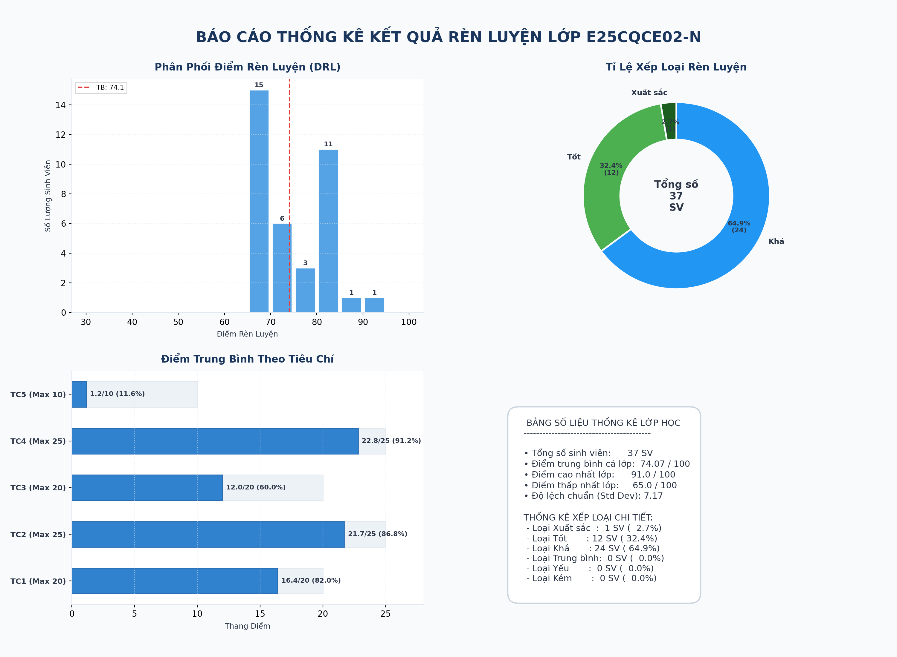
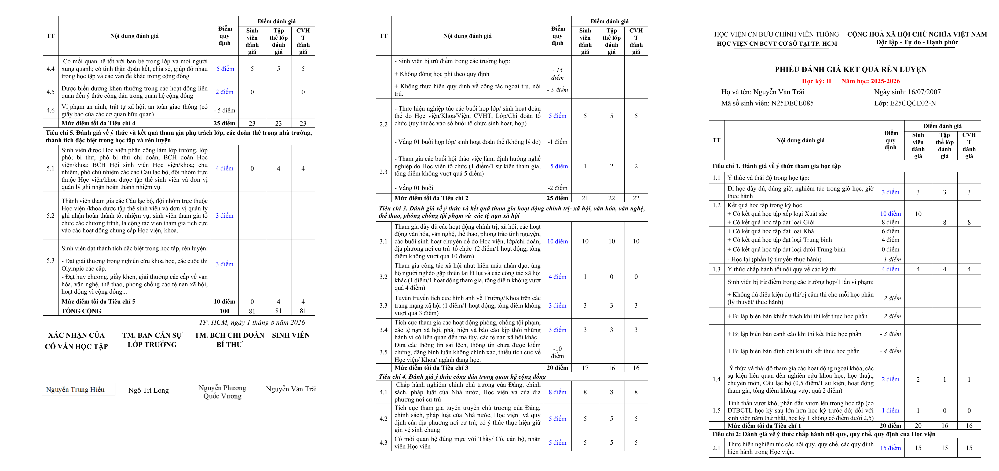
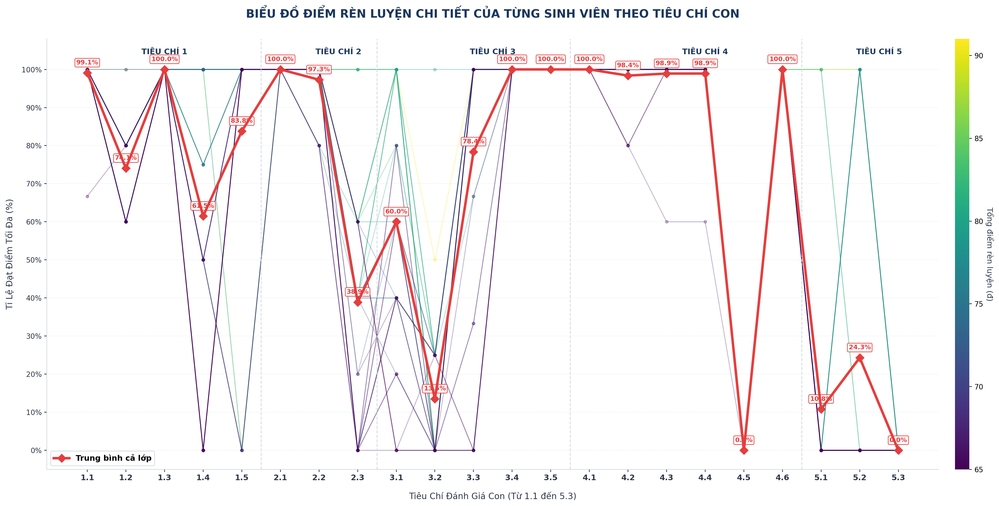

Automated pipeline for processing student training evaluation sheets (*Phiếu đánh giá kết quả rèn luyện*) for class **E25CQCE02-N**. Parses student self-evaluations, cross-references official scores, generates final Word documents for all 37 students, and compiles a detailed sub-section Excel report.

quick result can be found here on [Google Drive](https://drive.google.com/drive/folders/16J6rIboK8c9o4W_eTQlUI6b4l9qazNNB?usp=sharing)

## 📋 Table of Contents
* [Overview](#-overview)
* [Gallery & Output Previews](#-gallery--output-previews)
* [Codebase Structure](#-codebase-structure)
* [Document Architecture & Technical Details](#-document-architecture--technical-details)
* [Pipeline Workflow](#-pipeline-workflow)
* [Setup & Installation](#-setup--installation)
* [Usage](#-usage)

---

## 🔍 Overview

At the end of each semester, students submit training point evaluation documents (`.doc` or `.docx`). The process of converting `.doc` or `.docx` to `csv` might be public in another project, yet this pipeline automates:

1. **Loads scores & DOB** directly from `ai_studio_code.csv` and the official roster summary(sometimes scores have some differences between these file, you may need to do manual verification or just use chatgpt like me to compare and fix `csv` to match `xlsx`:D).
2. **Generates** final formatted Word documents for all 37 students (present and absent) using custom tab stops for info alignment.
3. **Renders** statistics charts and compiles an interactive performance HTML dashboard.

---

## 📊 Gallery & Output Previews

Here is a visual demonstration of the outputs produced by this pipeline:

### 1. Performance Analytics Dashboard (assets/drl_dashboard.html)
An interactive dashboard summarizing class performance, score breakdowns, and individual student statistics.

* **Interactive HTML Link**: [View Interactive Dashboard](assets/drl_dashboard.html)



### 2. Sample Generated Student Evaluation Sheet (Student 085)
A preview of the generated Word document (converted to PNG) for student Nguyễn Văn Trãi (MSV: N25DECE085), showing the custom tab alignment and grading matrix.



### 3. Student Subcriteria Line Chart
A static line chart displaying the subcriteria training points evaluation across the student cohort.



---

## 📁 Codebase Structure

| File / Folder | Description |
|---|---|
| `master.docx` | **Active template** — Google Docs-compatible, uses paragraph-based info block and shape-wrapped textbox for name |
| `HV_Mau 2_Tong hop KQRL cua SV.xlsx` | **Source of truth** — official final scores (do not modify) |
| `HV_Mau 2_Chi tiet KQRL.xlsx` | *(Legacy)* Detailed sub-section report (no longer generated) |
| `process_and_generate.py` | Main pipeline script |
| `render_charts.py` | Module for generating static DRL chart images |
| `render_html.py` | Module for generating the interactive DRL HTML dashboard |
| `assets/drl_dashboard.html` | *(Generated)* Interactive performance analytics dashboard |
| `charts/` | *(Generated)* Folder containing static DRL statistic charts |
| `combined/` | *(Generated)* Folder containing generated student sheet previews (PNG format) |
| `assets/` | Folder containing static README preview assets and the HTML dashboard |
| `STRUCTURE.md` | Document layout map (paragraph/table indices, cell mappings) |
| `GEMINI.md` | AI agent rules and constraints for this project |
| `students/` | Raw student papers (`.doc` / `.docx`) |
| `generated_students/` | *(Generated)* Final output Word files |

---

## 📐 Document Architecture & Technical Details

Each student's document is generated by copying the active template, [master.docx](master.docx), and filling in details using [process_and_generate.py](process_and_generate.py).

* **Student Info Alignment**: Aligned using a custom tab stop at **3.8 inches** on paragraphs 4 and 5 (`Name/DOB` and `MSV/Class`) to maintain format compatibility across different document viewers.
* **Grading Matrix & Scores**: Standard criteria table (56 rows) with columns for student self-scores, class scores, and advisor scores.
* **Name Signature Textbox**: Programmatically splits student names and places them inside shape textboxes to align perfectly under signature headers.
* **Mathematical Consistency**: Category totals and grand totals are verified and overwritten from the master Excel sheet ([HV_Mau 2_Tong hop KQRL cua SV.xlsx](HV_Mau%202_Tong%20hop%20KQRL%20cua%20SV.xlsx)).

For a comprehensive structural breakdown of the template's paragraphs, tables, cell indices, and detailed name-splitting logic, please refer to the dedicated [STRUCTURE.md](STRUCTURE.md) guide.

---

## ⚙️ Pipeline Workflow

### Step 1 — Database and Score Loading
- Reads the official student roster and final totals from `HV_Mau 2_Tong hop KQRL cua SV.xlsx`.
- Loads specific sub-criterion scores and student Date of Birth (DOB) data from `ai_studio_code.csv`.

### Step 2 — Per-student processing
1. Make a copy of `master.docx`.
2. Clear template info runs and insert student name, MSV, and DOB using custom tab stops.
3. Write subscores from the CSV data into the grading criteria table (Table 1) columns (Student, Class, Advisor).
4. Overwrite section totals and grand totals (Rows 20, 30, 37, 45, 52, 53) using values from the master Excel file to ensure 100% mathematical consistency.
5. Split the student name into the signature textbox (`##STUDENT` / `_NAME##`).
6. Save the final document in `generated_students/`.

### Step 3 — Charts & Dashboard Generation
- Unless `--disable-charts` is passed, runs `render_charts.py` to generate statistical charts (score distribution, rating breakdown, criteria averages) in `charts/`.
- Runs `render_html.py` to generate the interactive, highly optimized `assets/drl_dashboard.html`.

---

## 🛠️ Setup & Installation

Requires Python 3.

### Python packages
```bash
pip3 install python-docx openpyxl lxml pillow matplotlib numpy
```

---

## 🚀 Usage

Run the complete pipeline:
```bash
python3 process_and_generate.py
```

### Command Line Flags
You can customize the pipeline run using the following flags:
* `--disable-charts`: Skip generating statistic charts and the interactive HTML dashboard.
* `--gdrive-dir <path>`: Specify a path to Google Drive to enable syncing. If not specified, sync is disabled by default to avoid hangs on machines without the mount.

**Example:**
```bash
python3 process_and_generate.py --disable-charts
```
